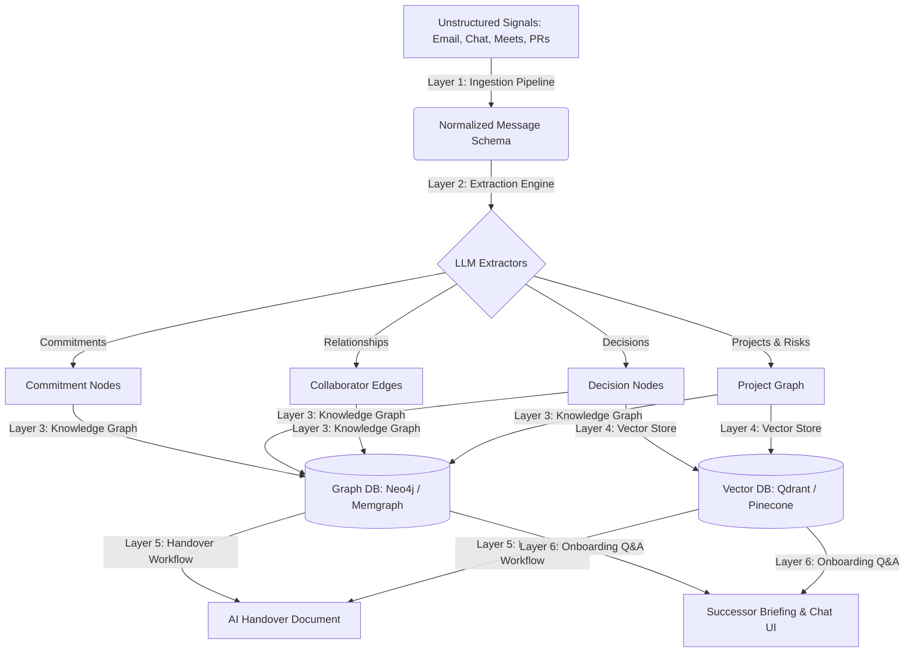

# Nexus AI: Handover Architecture Specification

This document details the architecture design of the **Nexus AI Handover Engine**. 

Traditional workspace applications store and query structured columns. Nexus AI works differently: it continuously ingests unstructured communication signals, runs extraction models, constructs a living semantic relationship graph, and answers successor onboarding questions.



---

## Layer 1: Ingestion Pipeline (Normalized Schema)

Every source channel (Slack, Gmail, Zoom, Jira, GitHub) is processed by dedicated ingestion workers and flattened into a standard message envelope:

```json
{
  "content": "I will complete the API integration tests and follow up with Stripe by Friday morning.",
  "source_type": "email",
  "participants": ["john.smith@nexus-ai.com", "sarah.jenks@nexus-ai.com"],
  "timestamp": "2026-06-10T02:40:44Z",
  "employee_id": "usr-john-smith",
  "thread_id": "thread-stripe-payment-101",
  "raw_id": "msg-gmail-921820"
}
```

---

## Layer 2: LLM Extraction Engines

Nexus runs parallel LLM extractors over normalized messages:

1. **Commitment Extractor**: Detects statements of intent (e.g. *"I'll send"*).
2. **Decision Extractor**: Captures architectural or team consensus (e.g. *"we decided to move from Firebase"*).
3. **Relationship Extractor**: Tracks communication frequency, sentiment, and topics between nodes.
4. **Project Signal Extractor**: Evaluates project state, timeline updates, and active blockers.
5. **Risk Extractor**: Identifies credentials, single points of failure (SPOF), and critical gaps.

### Structured Commitment Extraction Schema
```json
{
  "commitments": [{
    "actor": "John Smith",
    "action": "Complete API testing",
    "target": "Sarah Jenks",
    "deadline": "Friday",
    "verbatim_quote": "I will complete the API integration tests... by Friday",
    "confidence": 0.95
  }]
}
```

---

## Layer 3: Knowledge Graph Construction

We represent workspace context as a graph:
- **Nodes**: `Person`, `Project`, `Commitment`, `Decision`, `Entity` (clients, APIs, infrastructure nodes).
- **Edges**: 
  - `Person -[WORKS_ON]-> Project`
  - `Person -[COMMITTED_TO]-> Commitment`
  - `Person -[COLLABORATES_WITH]-> Person` (weight decays over time based on recency)

### Edge Weight Time Decay
To prevent stale relationships from cluttering the onboarding briefing, weights undergo exponential time decay:

$$\text{Weight} = \text{Interactions} \times e^{-\lambda t}$$

---

## Layer 4: Hybrid Retrieval Vector Store

We embed high-value extracted semantic items (decisions, risks, project briefings) rather than raw noisy chat logs.

```json
{
  "vector_id": "vec-dec-stripe-01",
  "payload": {
    "type": "decision",
    "title": "Migrate from Firebase to Supabase",
    "rationale": "Firebase costs were scaling and Row-Level Security was needed.",
    "people_involved": ["John Smith", "Snehal Patil"],
    "date": "2026-03-12"
  }
}
```

### Retrieval Pattern
When a successor asks: *"Why did we move from Firebase to Supabase?"*:
1. **Semantic Fetch**: Query the Vector Store for database migration rationales.
2. **Graph Fetch**: Query the Graph Database for all `Decision` nodes linked to the `Project` node or `John Smith`.
3. **Synthesis**: LLM merges graph and vector contexts to write a cited response.

---

## Development Roadmap

### Phase 1: MVP Batch Processing (Current Implementation)
- Manual or workspace-state batch compilation.
- Extractor run via Next.js `/api/handover/generate` calling the Gemini API.
- Graph simulated in high-fidelity SVG client-side rendering.
- Interactive Successor Q&A search box.

### Phase 2: Live Ingest Pipelines
- Slack webhook endpoints.
- BullMQ queuing to buffer emails and Slack streams.
- Continuous background runs of commitment and decision extractors.

### Phase 3: Graph DB & Vector DB Integration
- Neo4j instance hosting workspace relations.
- Qdrant cluster storing vector embeddings of decision history logs.
- Graph-native Cypher queries to resolve onboarding questions.
